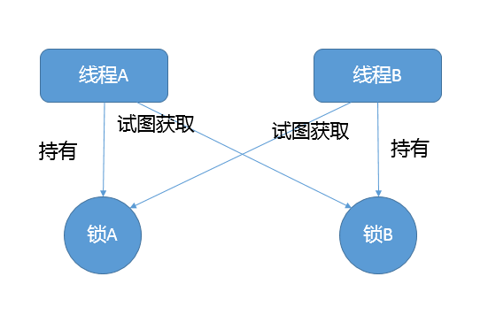
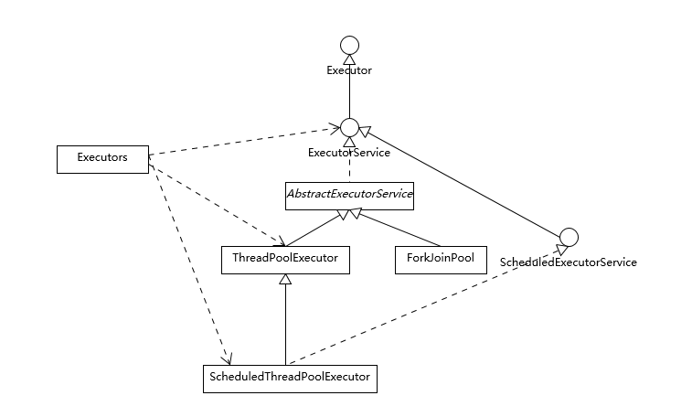
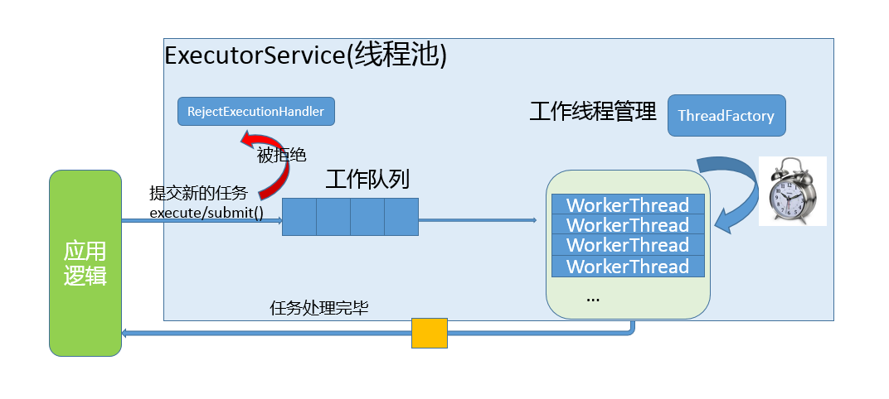
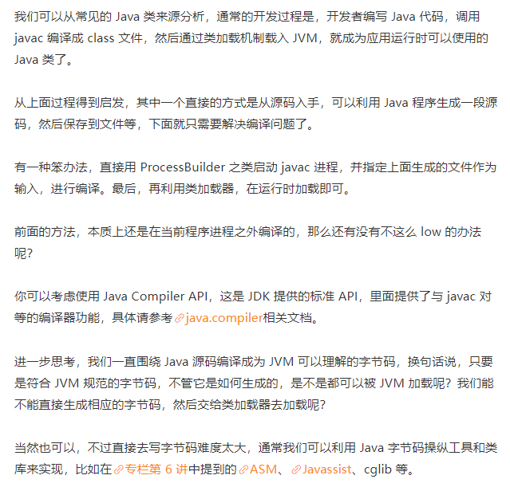
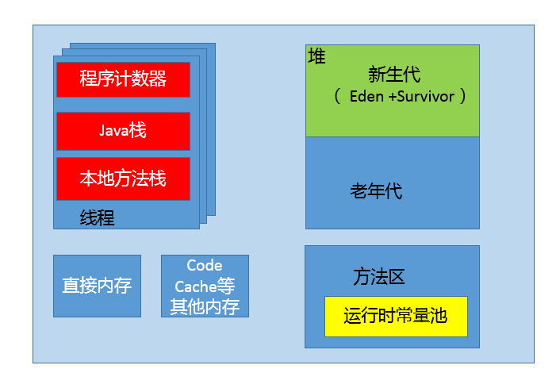
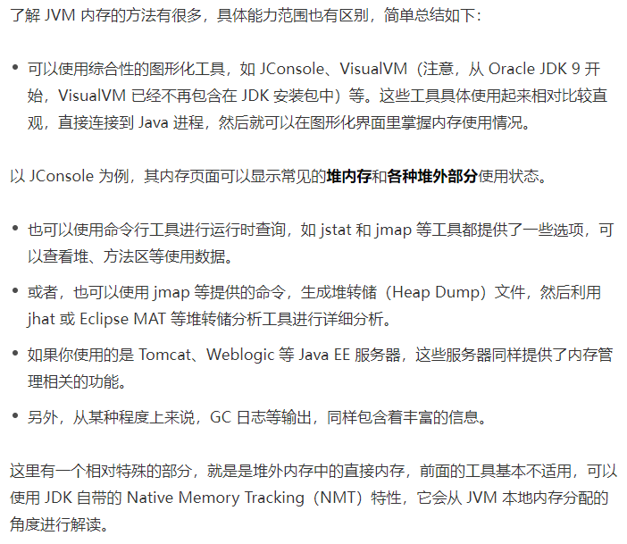
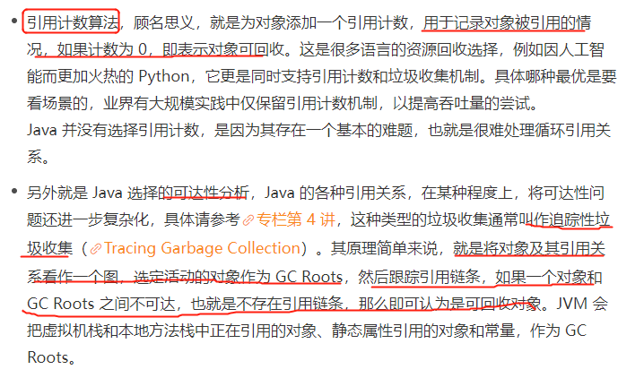
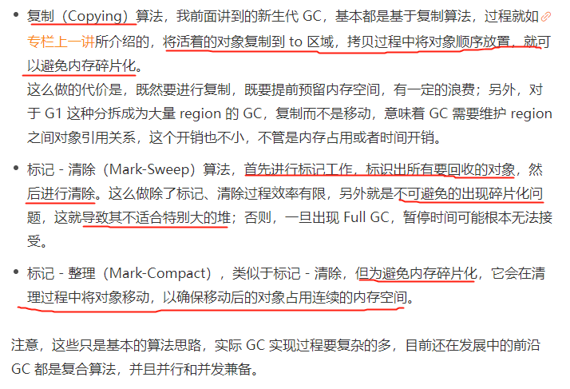

## 15 synchronized和ReentrantLock有什么区别呢
synchronized 是 Java 内建的同步机制，所以也有人称其为 Intrinsic Locking，它提供了互斥的语义和可见性，
当一个线程已经获取当前锁时，其他试图获取的线程只能等待或者阻塞在那里。

在 Java 5 以前，synchronized 是仅有的同步手段，在代码中， synchronized 可以用来修饰方法，也可以使用在特定的代码块儿上，
本质上 synchronized 方法等同于把方法全部语句用 synchronized 块包起来。

ReentrantLock，通常翻译为再入锁，是 Java 5 提供的锁实现，它的语义和 synchronized 基本相同。
再入锁通过代码直接调用 lock() 方法获取，代码书写也更加灵活。与此同时，ReentrantLock 提供了很多实用的方法，
能够实现很多 synchronized 无法做到的细节控制，比如可以控制 fairness，也就是公平性，或者利用定义条件等。
但是，编码中也需要注意，必须要明确调用 unlock() 方法释放，不然就会一直持有该锁。

synchronized 和 ReentrantLock 的性能不能一概而论，早期版本 synchronized 在很多场景下性能相差较大，
在后续版本进行了较多改进，在低竞争场景中表现可能优于 ReentrantLock。

线程安全需要保证几个基本特性：

* 原子性，简单说就是相关操作不会中途被其他线程干扰，一般通过同步机制实现。
* 可见性，是一个线程修改了某个共享变量，其状态能够立即被其他线程知晓，通常被解释为将线程本地状态反映到主内存上，
  volatile 就是负责保证可见性的。 
* 有序性，是保证线程内串行语义，避免指令重排等

ReentrantLock是Lock的实现类，是一个互斥的同步器，在多线程高竞争条件下，ReentrantLock比synchronized有更加优异的性能表现。

* 1 用法比较

Lock使用起来比较灵活，但是必须有释放锁的配合动作

Lock必须手动获取与释放锁，而synchronized不需要手动释放和开启锁

Lock只适用于代码块锁，而synchronized可用于修饰方法、代码块等

* 2 特性比较

ReentrantLock的优势体现在：

具备尝试非阻塞地获取锁的特性：当前线程尝试获取锁，如果这一时刻锁没有被其他线程获取到，则成功获取并持有锁

能被中断地获取锁的特性：与synchronized不同，获取到锁的线程能够响应中断，当获取到锁的线程被中断时，中断异常将会被抛出，同时锁会被释放

超时获取锁的特性：在指定的时间范围内获取锁；如果截止时间到了仍然无法获取锁，则返回

* 3 注意事项

在使用ReentrantLock类的时，一定要注意三点：

在finally中释放锁，目的是保证在获取锁之后，最终能够被释放

不要将获取锁的过程写在try块内，因为如果在获取锁时发生了异常，异常抛出的同时，也会导致锁无故被释放。

ReentrantLock提供了一个newCondition的方法，以便用户在同一锁的情况下可以根据不同的情况执行等待或唤醒的动作。

## 16 synchronized 底层如何实现？什么是锁的升级、降级？
synchronized 代码块是由一对儿 monitorenter/monitorexit 指令实现的，Monitor 对象是同步的基本实现单元。

在 Java 6 之前，Monitor 的实现完全是依靠操作系统内部的互斥锁，因为需要进行用户态到内核态的切换，
所以同步操作是一个无差别的重量级操作。

现代的（Oracle）JDK 中，JVM 对此进行了大刀阔斧地改进，提供了三种不同的 Monitor 实现，
也就是常说的三种不同的锁：**偏斜锁（Biased Locking）、轻量级锁和重量级锁**，大大改进了其性能。

所谓**锁的升级、降级**，就是 JVM 优化 synchronized 运行的机制，当 JVM 检测到不同的竞争状况时，会自动切换到适合的锁实现，
这种切换就是锁的升级、降级。

当没有竞争出现时，默认会使用**偏斜锁**。JVM 会利用 CAS 操作（compare and swap），在对象头上的 Mark Word 部分设置线程 ID，
以表示这个对象偏向于当前线程，所以并不涉及真正的互斥锁。这样做的假设是基于在很多应用场景中，
大部分对象生命周期中最多会被一个线程锁定，使用偏斜锁可以降低无竞争开销。如果有另外的线程试图锁定某个已经被偏斜过的对象，
JVM 就需要撤销（revoke）偏斜锁，并切换到轻量级锁实现。轻量级锁依赖 CAS 操作 Mark Word 来试图获取锁，
如果重试成功，就使用普通的轻量级锁；否则，进一步升级为重量级锁。

我注意到有的观点认为 Java 不会进行锁降级。实际上据我所知，锁降级确实是会发生的，当 JVM 进入安全点（SafePoint）的时候，
会检查是否有闲置的 Monitor，然后试图进行降级。

**自旋锁**:竞争锁的失败的线程，并不会真实的在操作系统层面挂起等待，而是JVM会让线程做几个空循环(基于预测在不久的将来就能获得)，在经过若干次循环后，如果可以获得锁，那么进入临界区，如果还不能获得锁，才会真实的将线程在操作系统层面进行挂起。

适用场景:自旋锁可以减少线程的阻塞，这对于锁竞争不激烈，且占用锁时间非常短的代码块来说，有较大的性能提升，因为自旋的消耗会小于线程阻塞挂起操作的消耗。
如果锁的竞争激烈，或者持有锁的线程需要长时间占用锁执行同步块，就不适合使用自旋锁了，因为自旋锁在获取锁前一直都是占用cpu做无用功，线程自旋的消耗大于线程阻塞挂起操作的消耗，造成cpu的浪费。

## 一个线程两次调用 start() 方法会出现什么情况？谈谈线程的生命周期和状态转移。
Java 的线程是不允许启动两次的，第二次调用必然会抛出 IllegalThreadStateException，这是一种运行时异常，多次调用 start 被认为是编程错误。

关于线程生命周期的不同状态，在 Java 5 以后，线程状态被明确定义在其公共内部枚举类型 java.lang.Thread.State 中，分别是：
* 新建（NEW），表示线程被创建出来还没真正启动的状态，可以认为它是个 Java 内部状态。
* 就绪（RUNNABLE），表示该线程已经在 JVM 中执行，当然由于执行需要计算资源，它可能是正在运行，也可能还在等待系统分配给它 CPU 片段，在就绪队列里面排队。
* 在其他一些分析中，会额外区分一种状态 RUNNING，但是从 Java API 的角度，并不能表示出来。
* 阻塞（BLOCKED），这个状态和我们前面两讲介绍的同步非常相关，阻塞表示线程在等待 Monitor lock。比如，线程试图通过 synchronized 去获取某个锁，但是其他线程已经独占了，那么当前线程就会处于阻塞状态。
* 等待（WAITING），表示正在等待其他线程采取某些操作。一个常见的场景是类似生产者消费者模式，发现任务条件尚未满足，就让当前消费者线程等待（wait），另外的生产者线程去准备任务数据，然后通过类似 notify 等动作，通知消费线程可以继续工作了。Thread.join() 也会令线程进入等待状态。
* 计时等待（TIMED_WAIT），其进入条件和等待状态类似，但是调用的是存在超时条件的方法，比如 wait 或 join 等方法的指定超时版本，如下面示例：
  

     public final native void wait(long timeout) throws InterruptedException;

* 终止（TERMINATED），不管是意外退出还是正常执行结束，线程已经完成使命，终止运行，也有人把这个状态叫作死亡。
  
在第二次调用 start() 方法的时候，线程可能处于终止或者其他（非 NEW）状态，但是不论如何，都是不可以再次启动的。

从操作系统的角度，可以简单认为，**线程是系统调度的最小单元**，一个进程可以包含多个线程，作为任务的真正运作者，有自己的栈（Stack）、寄存器（Register）、本地存储（Thread Local）等，但是会和进程内其他线程共享文件描述符、虚拟地址空间等

线程状态和方法之间的对应图：

## 18 什么情况下Java程序会产生死锁？如何定位、修复？
**死锁**是一种特定的程序状态，在实体之间，由于循环依赖导致彼此一直处于等待之中，没有任何个体可以继续前进。死锁不仅仅是在线程之间会发生，存在资源独占的进程之间同样也可能出现死锁。通常来说，我们大多是聚焦在多线程场景中的死锁，指两个或多个线程之间，由于互相持有对方需要的锁，而永久处于阻塞的状态。

你可以利用下面的示例图理解基本的死锁问题：

定位死锁最常见的方式就是利用 jstack 等工具获取线程栈，然后定位互相之间的依赖关系，进而找到死锁。如果是比较明显的死锁，往往 jstack 等就能直接定位，类似 JConsole 甚至可以在图形界面进行有限的死锁检测。

如果程序运行时发生了死锁，绝大多数情况下都是无法在线解决的，只能重启、修正程序本身问题。所以，代码开发阶段互相审查，或者利用工具进行预防性排查，往往也是很重要的。考点

**死锁的原因：**

    互斥条件，类似 Java 中 Monitor 都是独占的，要么是我用，要么是你用。
    互斥条件是长期持有的，在使用结束之前，自己不会释放，也不能被其他线程抢占。
    循环依赖关系，两个或者多个个体之间出现了锁的链条环。

## 19 Java 并发包提供了哪些并发工具类？
我们通常所说的并发包也就是 java.util.concurrent 及其子包，集中了 Java 并发的各种基础工具类，具体主要包括几个方面：
* 提供了比 synchronized 更加高级的各种同步结构，包括 CountDownLatch、CyclicBarrier、Semaphore 等，可以实现更加丰富的多线程操作，比如利用 Semaphore 作为资源控制器，限制同时进行工作的线程数量。
* 各种线程安全的容器，比如最常见的 ConcurrentHashMap、有序的 ConcurrentSkipListMap，或者通过类似快照机制，实现线程安全的动态数组 CopyOnWriteArrayList 等。
* 各种并发队列实现，如各种 BlockingQueue 实现，比较典型的 ArrayBlockingQueue、 SynchronousQueue 或针对特定场景的 PriorityBlockingQueue 等。
* 强大的 Executor 框架，可以创建各种不同类型的线程池，调度任务运行等，绝大部分情况下，不再需要自己从头实现线程池和任务调度器。

    CountDownLatch，允许一个或多个线程等待某些操作完成。
    CyclicBarrier，一种辅助性的同步结构，允许多个线程等待到达某个屏障。
    Semaphore，Java 版本的信号量实现。

CountDownLatch 和 CyclicBarrier区别：
* CountDownLatch 是不可以重置的，所以无法重用；而 CyclicBarrier 则没有这种限制，可以重用。
* CountDownLatch 的基本操作组合是 countDown/await。调用 await 的线程阻塞等待 countDown 足够的次数，不管你是在一个线程还是多个线程里 countDown，只要次数足够即可。所以就像 Brain Goetz 说过的，CountDownLatch 操作的是事件。
* CyclicBarrier 的基本操作组合，则就是 await，当所有的伙伴（parties）都调用了 await，才会继续进行任务，并自动进行重置。注意，正常情况下，CyclicBarrier 的重置都是自动发生的，如果我们调用 reset 方法，但还有线程在等待，就会导致等待线程被打扰，抛出 BrokenBarrierException 异常。CyclicBarrier 侧重点是线程，而不是调用事件，它的典型应用场景是用来等待并发线程结束

## 20 并发包中的ConcurrentLinkedQueue和LinkedBlockingQueue有什么区别？
* Concurrent 类型基于 lock-free，在常见的多线程访问场景，一般可以提供较高吞吐量。
* 而 LinkedBlockingQueue 内部则是基于锁，并提供了 BlockingQueue 的等待性方法。

java.util.concurrent 包提供的容器（Queue、List、Set）、Map，从命名上可以大概区分为 Concurrent*、CopyOnWrite和 Blocking等三类，同样是线程安全容器，可以简单认为：
* Concurrent 类型没有类似 CopyOnWrite 之类容器相对较重的修改开销。
* 但是，凡事都是有代价的，Concurrent 往往提供了较低的遍历一致性。你可以这样理解所谓的弱一致性，例如，当利用迭代器遍历时，如果容器发生修改，迭代器仍然可以继续进行遍历。
* 与弱一致性对应的，就是我介绍过的同步容器常见的行为“fail-fast”，也就是检测到容器在遍历过程中发生了修改，则抛出 ConcurrentModificationException，不再继续遍历。
* 弱一致性的另外一个体现是，size 等操作准确性是有限的，未必是 100% 准确。
* 与此同时，读取的性能具有一定的不确定性。

BlockingQueue 经常被考察的点，就是是否有界（Bounded、Unbounded）：
* ArrayBlockingQueue 是最典型的的有界队列，其内部以 final 的数组保存数据，数组的大小就决定了队列的边界，所以我们在创建 ArrayBlockingQueue 时，都要指定容量。
* LinkedBlockingQueue，容易被误解为无边界，但其实其行为和内部代码都是基于有界的逻辑实现的，只不过如果我们没有在创建队列时就指定容量，那么其容量限制就自动被设置为 Integer.MAX_VALUE，成为了无界队列。
* SynchronousQueue，这是一个非常奇葩的队列实现，每个删除操作都要等待插入操作，反之每个插入操作也都要等待删除动作。那么这个队列的容量是多少呢？是 1 吗？其实不是的，其内部容量是 0。
* PriorityBlockingQueue 是无边界的优先队列，虽然严格意义上来讲，其大小总归是要受系统资源影响。
* DelayedQueue 和 LinkedTransferQueue 同样是无边界的队列。对于无边界的队列，有一个自然的结果，就是 put 操作永远也不会发生其他 BlockingQueue 的那种等待情况。

## 21 Java并发类库提供的线程池有哪几种？ 分别有什么特点？
通常开发者都是利用 Executors 提供的通用线程池创建方法，去创建不同配置的线程池，主要区别在于不同的 ExecutorService 类型或者不同的初始参数。

Executors 目前提供了 5 种不同的线程池创建配置：
* newCachedThreadPool()，它是一种用来处理**大量短时间工作任务**的线程池，具有几个鲜明特点：它会试图缓存线程并重用，当无缓存线程可用时，就会创建新的工作线程；如果线程闲置的时间超过 60 秒，则被终止并移出缓存；长时间闲置时，这种线程池，不会消耗什么资源。其内部使用 SynchronousQueue 作为工作队列。
* newFixedThreadPool(int nThreads)，重用**指定数目**（nThreads）的线程，其背后使用的是无界的工作队列，任何时候最多有 nThreads 个工作线程是活动的。这意味着，如果任务数量超过了活动队列数目，将在工作队列中等待空闲线程出现；如果有工作线程退出，将会有新的工作线程被创建，以补足指定的数目 nThreads。
* newSingleThreadExecutor()，它的特点在于工作**线程数目被限制为 1**，操作一个无界的工作队列，所以它保证了所有任务的都是被顺序执行，最多会有一个任务处于活动状态，并且不允许使用者改动线程池实例，因此可以避免其改变线程数目。
* newSingleThreadScheduledExecutor() 和 newScheduledThreadPool(int corePoolSize)，创建的是个 ScheduledExecutorService，可以进行**定时或周期性**的工作调度，区别在于单一工作线程还是多个工作线程。
* newWorkStealingPool(int parallelism)，这是一个经常被人忽略的线程池，Java 8 才加入这个创建方法，其内部会构建ForkJoinPool，利用Work-Stealing算法，并行地处理任务，不保证处理顺序。

应用与线程池的交互和线程池的内部工作过程图：

* 工作队列负责存储用户提交的各个任务，这个工作队列，可以是容量为 0 的 SynchronousQueue（使用 newCachedThreadPool），也可以是像固定大小线程池（newFixedThreadPool）那样使用 LinkedBlockingQueue
* 内部的“线程池”，这是指保持工作线程的集合，线程池需要在运行过程中管理线程创建、销毁。例如，对于带缓存的线程池，当任务压力较大时，线程池会创建新的工作线程；当业务压力退去，线程池会在闲置一段时间（默认 60 秒）后结束线程。

线程数 = CPU核数 × 目标CPU利用率 ×（1 + 平均等待时间/平均工作时间）

## 22 AtomicInteger底层实现原理是什么？如何在自己的产品代码中应用CAS操作？
AtomicIntger 是对 int 类型的一个封装，提供原子性的访问和更新操作，其原子性操作的实现是基于 CAS（compare-and-swap）技术。

所谓 **CAS**，表征的是一系列操作的集合，获取当前数值，进行一些运算，利用 CAS 指令试图进行更新。如果当前数值未变，代表没有其他线程进行并发修改，则成功更新。否则，可能出现不同的选择，要么进行重试，要么就返回一个成功或者失败的结果。

从 AtomicInteger 的内部属性可以看出，它依赖于 Unsafe 提供的一些底层能力，进行底层操作；以 volatile 的 value 字段，记录数值，以保证可见性。

    private static final jdk.internal.misc.Unsafe U = jdk.internal.misc.Unsafe.getUnsafe();
    private static final long VALUE = U.objectFieldOffset(AtomicInteger.class, "value");
    private volatile int value;

具体的原子操作细节，可以参考任意一个原子更新方法，比如下面的 getAndIncrement。

Unsafe 会利用 value 字段的内存地址偏移，直接完成操作。

    public final int getAndIncrement() {
      return U.getAndAddInt(this, VALUE, 1);
    }

因为 getAndIncrement 需要返归数值，所以需要添加失败重试逻辑。

    public final int getAndAddInt(Object o, long offset, int delta) {
      int v;
       do {
           v = getIntVolatile(o, offset);
      } while (!weakCompareAndSetInt(o, offset, v, v + delta));
         return v;
    }

而类似 compareAndSet 这种返回 boolean 类型的函数，因为其返回值表现的就是成功与否，所以不需要重试。

    public final boolean compareAndSet(int expectedValue, int newValue)

CAS 是 Java 并发中所谓 lock-free 机制的基础。

AQS 内部数据和方法，可以简单拆分为：
* 一个 volatile 的整数成员表征状态，同时提供了 setState 和 getState 方法   private volatile int state;
* 一个先入先出（FIFO）的等待线程队列，以实现多线程间竞争和等待，这是 AQS 机制的核心之一。
* 各种基于 CAS 的基础操作方法，以及各种期望具体同步结构去实现的 acquire/release 方法。

## 23 请介绍类加载过程，什么是双亲委派模型？
一般来说，我们把 Java 的类加载过程分为三个主要步骤：**加载、链接、初始化**，具体行为在Java 虚拟机规范里有非常详细的定义。

首先是加载阶段（Loading），它是 Java 将字节码数据从不同的数据源读取到 JVM 中，并映射为 JVM 认可的数据结构（Class 对象），这里的数据源可能是各种各样的形态，如 jar 文件、class 文件，甚至是网络数据源等；如果输入数据不是 ClassFile 的结构，则会抛出 ClassFormatError。

加载阶段是用户参与的阶段，我们可以自定义类加载器，去实现自己的类加载过程。

第二阶段是链接（Linking），这是核心的步骤，简单说是把原始的类定义信息平滑地转化入 JVM 运行的过程中。这里可进一步细分为三个步骤：
* 验证（Verification），这是虚拟机安全的重要保障，JVM 需要核验字节信息是符合 Java 虚拟机规范的，否则就被认为是 VerifyError，这样就防止了恶意信息或者不合规的信息危害 JVM 的运行，验证阶段有可能触发更多 class 的加载。
* 准备（Preparation），创建类或接口中的静态变量，并初始化静态变量的初始值。但这里的“初始化”和下面的显式初始化阶段是有区别的，侧重点在于分配所需要的内存空间，不会去执行更进一步的 JVM 指令。
* 解析（Resolution），在这一步会将常量池中的符号引用（symbolic reference）替换为直接引用。在Java 虚拟机规范中，详细介绍了类、接口、方法和字段等各个方面的解析。

最后是初始化阶段（initialization），这一步真正去执行类初始化的代码逻辑，包括静态字段赋值的动作，以及执行类定义中的静态初始化块内的逻辑，编译器在编译阶段就会把这部分逻辑整理好，父类型的初始化逻辑优先于当前类型的逻辑。

再来谈谈双亲委派模型，简单说就是当类加载器（Class-Loader）试图加载某个类型的时候，除非父加载器找不到相应类型，否则尽量将这个任务代理给当前加载器的父加载器去做。使用委派模型的目的是避免重复加载 Java 类型。

类加载：
* 启动类加载器（Bootstrap Class-Loader），加载 jre/lib 下面的 jar 文件，如 rt.jar。它是个超级公民，即使是在开启了 Security Manager 的时候，JDK 仍赋予了它加载的程序 AllPermission。
* 扩展类加载器（Extension or Ext Class-Loader），负责加载我们放到 jre/lib/ext/ 目录下面的 jar 包，这就是所谓的 extension 机制。该目录也可以通过设置 “java.ext.dirs”来覆盖。
* 应用类加载器（Application or App Class-Loader），就是加载我们最熟悉的 classpath 的内容。这里有一个容易混淆的概念，系统（System）类加载器，通常来说，其默认就是 JDK 内建的应用类加载器，但是它同样是可能修改的。

通常类加载机制有三个基本特征：

## 24  有哪些方法可以在运行时动态生成一个Java类？

## 25  谈谈JVM内存区域的划分，哪些区域可能发生OutOfMemoryError?
通常可以把 JVM 内存区域分为下面几个方面，其中，有的区域是以线程为单位，而有的区域则是整个 JVM 进程唯一的。

首先，程序计数器（PC，Program Counter Register）。在 JVM 规范中，每个线程都有它自己的程序计数器，并且任何时间一个线程都只有一个方法在执行，也就是所谓的当前方法。程序计数器会存储当前线程正在执行的 Java 方法的 JVM 指令地址；或者，如果是在执行本地方法，则是未指定值（undefined）。

第二，Java 虚拟机栈（Java Virtual Machine Stack），早期也叫 Java 栈。每个线程在创建时都会创建一个虚拟机栈，其内部保存一个个的栈帧（Stack Frame），对应着一次次的 Java 方法调用。

前面谈程序计数器时，提到了当前方法；同理，在一个时间点，对应的只会有一个活动的栈帧，通常叫作当前帧，方法所在的类叫作当前类。如果在该方法中调用了其他方法，对应的新的栈帧会被创建出来，成为新的当前帧，一直到它返回结果或者执行结束。JVM 直接对 Java 栈的操作只有两个，就是对栈帧的压栈和出栈。

栈帧中存储着局部变量表、操作数（operand）栈、动态链接、方法正常退出或者异常退出的定义等。

第三，堆（Heap），它是 Java 内存管理的核心区域，用来放置 Java 对象实例，几乎所有创建的 Java 对象实例都是被直接分配在堆上。堆被所有的线程共享，在虚拟机启动时，我们指定的“Xmx”之类参数就是用来指定最大堆空间等指标。

理所当然，堆也是垃圾收集器重点照顾的区域，所以堆内空间还会被不同的垃圾收集器进行进一步的细分，最有名的就是新生代、老年代的划分。

第四，方法区（Method Area）。这也是所有线程共享的一块内存区域，用于存储所谓的元（Meta）数据，例如类结构信息，以及对应的运行时常量池、字段、方法代码等。

由于早期的 Hotspot JVM 实现，很多人习惯于将方法区称为永久代（Permanent Generation）。Oracle JDK 8 中将永久代移除，同时增加了元数据区（Metaspace）。

第五，运行时常量池（Run-Time Constant Pool），这是方法区的一部分。如果仔细分析过反编译的类文件结构，你能看到版本号、字段、方法、超类、接口等各种信息，还有一项信息就是常量池。Java 的常量池可以存放各种常量信息，不管是编译期生成的各种字面量，还是需要在运行时决定的符号引用，所以它比一般语言的符号表存储的信息更加宽泛。

第六，本地方法栈（Native Method Stack）。它和 Java 虚拟机栈是非常相似的，支持对本地方法的调用，也是每个线程都会创建一个。在 Oracle Hotspot JVM 中，本地方法栈和 Java 虚拟机栈是在同一块儿区域，这完全取决于技术实现的决定，并未在规范中强制。

## 26  如何监控和诊断JVM堆内和堆外内存使用？

## 27 Java常见的垃圾收集器有哪些？
实际上，垃圾收集器（GC，Garbage Collector）是和具体 JVM 实现紧密相关的，不同厂商（IBM、Oracle），不同版本的 JVM，提供的选择也不同。接下来，我来谈谈最主流的 Oracle JDK

* Serial GC，它是最古老的垃圾收集器，“Serial”体现在其收集工作是**单线程**的，并且在进行垃圾收集过程中，会进入臭名昭著的“Stop-The-World”状态。当然，其单线程设计也意味着精简的 GC 实现，无需维护复杂的数据结构，初始化也简单，所以一直是 Client 模式下 JVM 的默认选项。从年代的角度，通常将其老年代实现单独称作 Serial Old，它采用了标记 - 整理（Mark-Compact）算法，区别于新生代的复制算法。Serial GC 的对应 JVM 参数是：
  

    -XX:+UseSerialGC
* ParNew GC，很明显是个新生代 GC 实现，它实际是 Serial GC 的**多线程版本**，最常见的应用场景是配合老年代的 CMS GC 工作，下面是对应参数

    -XX:+UseConcMarkSweepGC -XX:+UseParNewGC
* CMS（Concurrent Mark Sweep） GC，基于标记 - 清除（Mark-Sweep）算法，设计目标是**尽量减少停顿时间**，这一点对于 Web 等反应时间敏感的应用非常重要，一直到今天，仍然有很多系统使用 CMS GC。但是，CMS 采用的标记 - 清除算法，存在着内存碎片化问题，所以难以避免在长时间运行等情况下发生 full GC，导致恶劣的停顿。另外，既然强调了并发（Concurrent），CMS 会占用更多 CPU 资源，并和用户线程争抢。
* Parallel GC，在早期 JDK 8 等版本中，它是 server 模式 JVM 的默认 GC 选择，也被称作是**吞吐量优先**的 GC。它的算法和 Serial GC 比较相似，尽管实现要复杂的多，其特点是新生代和老年代 GC 都是并行进行的，在常见的服务器环境中更加高效。开启选项是：

    -XX:+UseParallelGC
另外，Parallel GC 引入了开发者友好的配置项，我们可以直接设置暂停时间或吞吐量等目标，JVM 会自动进行适应性调整，例如下面参数：

    -XX:MaxGCPauseMillis=value
    -XX:GCTimeRatio=N // GC时间和用户时间比例 = 1 / (N+1)
* G1 GC 这是一种兼顾吞吐量和停顿时间的 GC 实现，是 Oracle JDK 9 以后的默认 GC 选项。G1 可以直观的设定停顿时间的目标，相比于 CMS GC，G1 未必能做到 CMS 在最好情况下的延时停顿，但是最差情况要好很多。G1 GC 仍然存在着年代的概念，但是其内存结构并不是简单的条带式划分，而是类似棋盘的一个个 region。Region 之间是复制算法，但整体上实际可看作是标记 - 整理（Mark-Compact）算法，可以有效地避免内存碎片，尤其是当 Java 堆非常大的时候，G1 的优势更加明显。G1 吞吐量和停顿表现都非常不错，并且仍然在不断地完善，与此同时 CMS 已经在 JDK 9 中被标记为废弃（deprecated），所以 G1 GC 值得你深入掌握

对于对象实例收集，主要是两种基本算法，引用计数和可达性分析。

常见的垃圾收集算法：

VM提供的收集器较多，特征不一，适用于不同的业务场景：

* Serial收集器：串行运行；作用于新生代；复制算法；响应速度优先；适用于单CPU环境下的client模式。
* ParNew收集器：并行运行；作用于新生代；复制算法；响应速度优先；多CPU环境Server模式下与CMS配合使用。
* Parallel Scavenge收集器：并行运行；作用于新生代；复制算法；吞吐量优先；适用于后台运算而不需要太多交互的场景。
* Serial Old收集器：串行运行；作用于老年代；标记-整理算法；响应速度优先；单CPU环境下的Client模式。
* Parallel Old收集器：并行运行；作用于老年代；标记-整理算法；吞吐量优先；适用于后台运算而不需要太多交互的场景。
* CMS收集器：并发运行；作用于老年代；标记-清除算法；响应速度优先；适用于互联网或B/S业务。
* G1收集器：并发运行；可作用于新生代或老年代；标记-整理算法+复制算法；响应速度优先；面向服务端应用。

## 28 谈谈你的 GC 调优思路？

