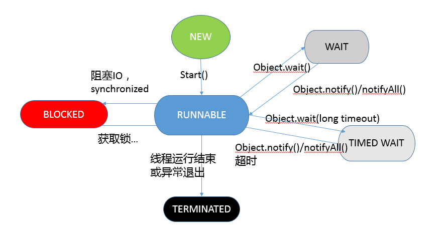

## 15 synchronized和ReentrantLock有什么区别呢
synchronized 是 Java 内建的同步机制，所以也有人称其为 Intrinsic Locking，它提供了互斥的语义和可见性，
当一个线程已经获取当前锁时，其他试图获取的线程只能等待或者阻塞在那里。

在 Java 5 以前，synchronized 是仅有的同步手段，在代码中， synchronized 可以用来修饰方法，也可以使用在特定的代码块儿上，
本质上 synchronized 方法等同于把方法全部语句用 synchronized 块包起来。

ReentrantLock，通常翻译为再入锁，是 Java 5 提供的锁实现，它的语义和 synchronized 基本相同。
再入锁通过代码直接调用 lock() 方法获取，代码书写也更加灵活。与此同时，ReentrantLock 提供了很多实用的方法，
能够实现很多 synchronized 无法做到的细节控制，比如可以控制 fairness，也就是公平性，或者利用定义条件等。
但是，编码中也需要注意，必须要明确调用 unlock() 方法释放，不然就会一直持有该锁。

synchronized 和 ReentrantLock 的性能不能一概而论，早期版本 synchronized 在很多场景下性能相差较大，
在后续版本进行了较多改进，在低竞争场景中表现可能优于 ReentrantLock。

线程安全需要保证几个基本特性：

* 原子性，简单说就是相关操作不会中途被其他线程干扰，一般通过同步机制实现。
* 可见性，是一个线程修改了某个共享变量，其状态能够立即被其他线程知晓，通常被解释为将线程本地状态反映到主内存上，
  volatile 就是负责保证可见性的。 
* 有序性，是保证线程内串行语义，避免指令重排等

ReentrantLock是Lock的实现类，是一个互斥的同步器，在多线程高竞争条件下，ReentrantLock比synchronized有更加优异的性能表现。

* 1 用法比较

Lock使用起来比较灵活，但是必须有释放锁的配合动作

Lock必须手动获取与释放锁，而synchronized不需要手动释放和开启锁

Lock只适用于代码块锁，而synchronized可用于修饰方法、代码块等

* 2 特性比较

ReentrantLock的优势体现在：

具备尝试非阻塞地获取锁的特性：当前线程尝试获取锁，如果这一时刻锁没有被其他线程获取到，则成功获取并持有锁

能被中断地获取锁的特性：与synchronized不同，获取到锁的线程能够响应中断，当获取到锁的线程被中断时，中断异常将会被抛出，同时锁会被释放

超时获取锁的特性：在指定的时间范围内获取锁；如果截止时间到了仍然无法获取锁，则返回

* 3 注意事项

在使用ReentrantLock类的时，一定要注意三点：

在finally中释放锁，目的是保证在获取锁之后，最终能够被释放

不要将获取锁的过程写在try块内，因为如果在获取锁时发生了异常，异常抛出的同时，也会导致锁无故被释放。

ReentrantLock提供了一个newCondition的方法，以便用户在同一锁的情况下可以根据不同的情况执行等待或唤醒的动作。

## 16 synchronized 底层如何实现？什么是锁的升级、降级？
synchronized 代码块是由一对儿 monitorenter/monitorexit 指令实现的，Monitor 对象是同步的基本实现单元。

在 Java 6 之前，Monitor 的实现完全是依靠操作系统内部的互斥锁，因为需要进行用户态到内核态的切换，
所以同步操作是一个无差别的重量级操作。

现代的（Oracle）JDK 中，JVM 对此进行了大刀阔斧地改进，提供了三种不同的 Monitor 实现，
也就是常说的三种不同的锁：**偏斜锁（Biased Locking）、轻量级锁和重量级锁**，大大改进了其性能。

所谓**锁的升级、降级**，就是 JVM 优化 synchronized 运行的机制，当 JVM 检测到不同的竞争状况时，会自动切换到适合的锁实现，
这种切换就是锁的升级、降级。

当没有竞争出现时，默认会使用**偏斜锁**。JVM 会利用 CAS 操作（compare and swap），在对象头上的 Mark Word 部分设置线程 ID，
以表示这个对象偏向于当前线程，所以并不涉及真正的互斥锁。这样做的假设是基于在很多应用场景中，
大部分对象生命周期中最多会被一个线程锁定，使用偏斜锁可以降低无竞争开销。如果有另外的线程试图锁定某个已经被偏斜过的对象，
JVM 就需要撤销（revoke）偏斜锁，并切换到轻量级锁实现。轻量级锁依赖 CAS 操作 Mark Word 来试图获取锁，
如果重试成功，就使用普通的轻量级锁；否则，进一步升级为重量级锁。

我注意到有的观点认为 Java 不会进行锁降级。实际上据我所知，锁降级确实是会发生的，当 JVM 进入安全点（SafePoint）的时候，
会检查是否有闲置的 Monitor，然后试图进行降级。

**自旋锁**:竞争锁的失败的线程，并不会真实的在操作系统层面挂起等待，而是JVM会让线程做几个空循环(基于预测在不久的将来就能获得)，在经过若干次循环后，如果可以获得锁，那么进入临界区，如果还不能获得锁，才会真实的将线程在操作系统层面进行挂起。

适用场景:自旋锁可以减少线程的阻塞，这对于锁竞争不激烈，且占用锁时间非常短的代码块来说，有较大的性能提升，因为自旋的消耗会小于线程阻塞挂起操作的消耗。
如果锁的竞争激烈，或者持有锁的线程需要长时间占用锁执行同步块，就不适合使用自旋锁了，因为自旋锁在获取锁前一直都是占用cpu做无用功，线程自旋的消耗大于线程阻塞挂起操作的消耗，造成cpu的浪费。

## 一个线程两次调用 start() 方法会出现什么情况？谈谈线程的生命周期和状态转移。
Java 的线程是不允许启动两次的，第二次调用必然会抛出 IllegalThreadStateException，这是一种运行时异常，多次调用 start 被认为是编程错误。

关于线程生命周期的不同状态，在 Java 5 以后，线程状态被明确定义在其公共内部枚举类型 java.lang.Thread.State 中，分别是：
* 新建（NEW），表示线程被创建出来还没真正启动的状态，可以认为它是个 Java 内部状态。
* 就绪（RUNNABLE），表示该线程已经在 JVM 中执行，当然由于执行需要计算资源，它可能是正在运行，也可能还在等待系统分配给它 CPU 片段，在就绪队列里面排队。
* 在其他一些分析中，会额外区分一种状态 RUNNING，但是从 Java API 的角度，并不能表示出来。
* 阻塞（BLOCKED），这个状态和我们前面两讲介绍的同步非常相关，阻塞表示线程在等待 Monitor lock。比如，线程试图通过 synchronized 去获取某个锁，但是其他线程已经独占了，那么当前线程就会处于阻塞状态。
* 等待（WAITING），表示正在等待其他线程采取某些操作。一个常见的场景是类似生产者消费者模式，发现任务条件尚未满足，就让当前消费者线程等待（wait），另外的生产者线程去准备任务数据，然后通过类似 notify 等动作，通知消费线程可以继续工作了。Thread.join() 也会令线程进入等待状态。
* 计时等待（TIMED_WAIT），其进入条件和等待状态类似，但是调用的是存在超时条件的方法，比如 wait 或 join 等方法的指定超时版本，如下面示例：
  

     public final native void wait(long timeout) throws InterruptedException;

* 终止（TERMINATED），不管是意外退出还是正常执行结束，线程已经完成使命，终止运行，也有人把这个状态叫作死亡。
  
在第二次调用 start() 方法的时候，线程可能处于终止或者其他（非 NEW）状态，但是不论如何，都是不可以再次启动的。

从操作系统的角度，可以简单认为，**线程是系统调度的最小单元**，一个进程可以包含多个线程，作为任务的真正运作者，有自己的栈（Stack）、寄存器（Register）、本地存储（Thread Local）等，但是会和进程内其他线程共享文件描述符、虚拟地址空间等

线程状态和方法之间的对应图：

## 18 什么情况下Java程序会产生死锁？如何定位、修复？
**死锁**是一种特定的程序状态，在实体之间，由于循环依赖导致彼此一直处于等待之中，没有任何个体可以继续前进。死锁不仅仅是在线程之间会发生，存在资源独占的进程之间同样也可能出现死锁。通常来说，我们大多是聚焦在多线程场景中的死锁，指两个或多个线程之间，由于互相持有对方需要的锁，而永久处于阻塞的状态。

你可以利用下面的示例图理解基本的死锁问题：

定位死锁最常见的方式就是利用 jstack 等工具获取线程栈，然后定位互相之间的依赖关系，进而找到死锁。如果是比较明显的死锁，往往 jstack 等就能直接定位，类似 JConsole 甚至可以在图形界面进行有限的死锁检测。

如果程序运行时发生了死锁，绝大多数情况下都是无法在线解决的，只能重启、修正程序本身问题。所以，代码开发阶段互相审查，或者利用工具进行预防性排查，往往也是很重要的。考点

**死锁的原因：**

    互斥条件，类似 Java 中 Monitor 都是独占的，要么是我用，要么是你用。
    互斥条件是长期持有的，在使用结束之前，自己不会释放，也不能被其他线程抢占。
    循环依赖关系，两个或者多个个体之间出现了锁的链条环。

## 19 Java 并发包提供了哪些并发工具类？
我们通常所说的并发包也就是 java.util.concurrent 及其子包，集中了 Java 并发的各种基础工具类，具体主要包括几个方面：
* 提供了比 synchronized 更加高级的各种同步结构，包括 CountDownLatch、CyclicBarrier、Semaphore 等，可以实现更加丰富的多线程操作，比如利用 Semaphore 作为资源控制器，限制同时进行工作的线程数量。
* 各种线程安全的容器，比如最常见的 ConcurrentHashMap、有序的 ConcurrentSkipListMap，或者通过类似快照机制，实现线程安全的动态数组 CopyOnWriteArrayList 等。
* 各种并发队列实现，如各种 BlockingQueue 实现，比较典型的 ArrayBlockingQueue、 SynchronousQueue 或针对特定场景的 PriorityBlockingQueue 等。
* 强大的 Executor 框架，可以创建各种不同类型的线程池，调度任务运行等，绝大部分情况下，不再需要自己从头实现线程池和任务调度器。

    CountDownLatch，允许一个或多个线程等待某些操作完成。
    CyclicBarrier，一种辅助性的同步结构，允许多个线程等待到达某个屏障。
    Semaphore，Java 版本的信号量实现。

CountDownLatch 和 CyclicBarrier区别：
* CountDownLatch 是不可以重置的，所以无法重用；而 CyclicBarrier 则没有这种限制，可以重用。
* CountDownLatch 的基本操作组合是 countDown/await。调用 await 的线程阻塞等待 countDown 足够的次数，不管你是在一个线程还是多个线程里 countDown，只要次数足够即可。所以就像 Brain Goetz 说过的，CountDownLatch 操作的是事件。
* CyclicBarrier 的基本操作组合，则就是 await，当所有的伙伴（parties）都调用了 await，才会继续进行任务，并自动进行重置。注意，正常情况下，CyclicBarrier 的重置都是自动发生的，如果我们调用 reset 方法，但还有线程在等待，就会导致等待线程被打扰，抛出 BrokenBarrierException 异常。CyclicBarrier 侧重点是线程，而不是调用事件，它的典型应用场景是用来等待并发线程结束

## 20 

