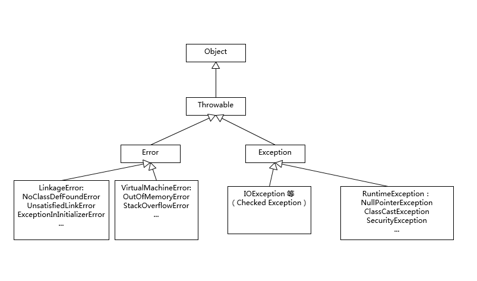

## 谈谈你对Java平台的理解
Java 本身是一种面向对象的语言，最显著的特性有两个方面，一是所谓的“书写一次，到处运行”（Write once, run anywhere），能够非常容易地获得跨平台能力；另外就是垃圾收集（GC, Garbage Collection），Java 通过垃圾收集器（Garbage Collector）回收分配内存，大部分情况下，程序员不需要自己操心内存的分配和回收。

我们日常会接触到 JRE（Java Runtime Environment）或者 JDK（Java Development Kit）。 JRE，也就是 Java 运行环境，包含了 JVM 和 Java 类库，以及一些模块等。而 JDK 可以看作是 JRE 的一个超集，提供了更多工具，比如编译器、各种诊断工具等。

对于“Java 是解释执行”这句话，这个说法不太准确。我们开发的 Java 的源代码，首先通过 Javac 编译成为字节码（bytecode），然后，在运行时，通过 Java 虚拟机（JVM）内嵌的解释器将字节码转换成为最终的机器码。但是常见的 JVM，比如我们大多数情况使用的 Oracle JDK 提供的 Hotspot JVM，都提供了 JIT（Just-In-Time）编译器，也就是通常所说的动态编译器，JIT 能够在运行时将热点代码编译成机器码，这种情况下部分热点代码就属于编译执行，而不是解释执行了。

## Exception和Error有什么区别？
Exception 和 Error 都是继承了 Throwable 类，在 Java 中只有 Throwable 类型的实例才可以被抛出（throw）或者捕获（catch），它是异常处理机制的基本组成类型。

Exception 和 Error 体现了 Java 平台设计者对不同异常情况的分类。Exception 是程序正常运行中，可以预料的意外情况，可能并且应该被捕获，进行相应处理。

Error 是指在正常情况下，不大可能出现的情况，绝大部分的 Error 都会导致程序（比如 JVM 自身）处于非正常的、不可恢复状态。既然是非正常情况，所以不便于也不需要捕获，常见的比如 OutOfMemoryError 之类，都是 Error 的子类。

Exception 又分为可检查（checked）异常和不检查（unchecked）异常，可检查异常在源代码里必须显式地进行捕获处理，这是编译期检查的一部分。前面我介绍的不可查的 Error，是 Throwable 不是 Exception。

不检查异常就是所谓的运行时异常，类似 NullPointerException、ArrayIndexOutOfBoundsException 之类，通常是可以编码避免的逻辑错误，具体根据需要来判断是否需要捕获，并不会在编译期强制要求。

