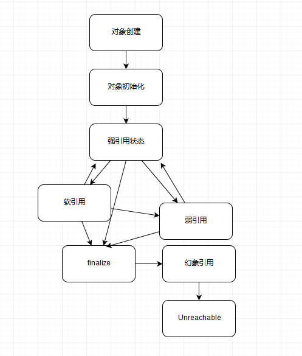
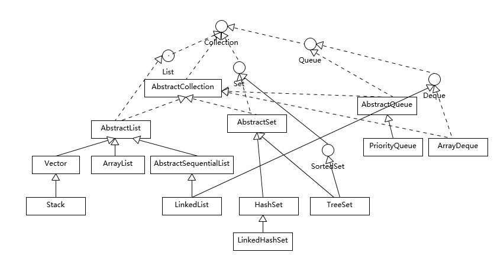
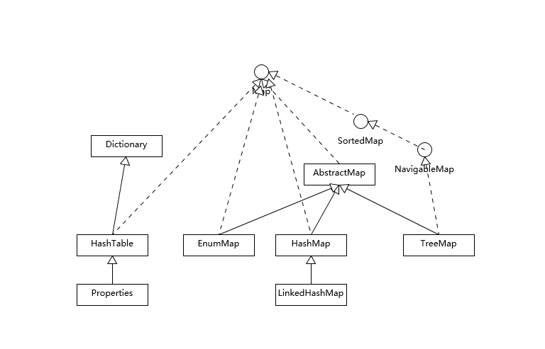
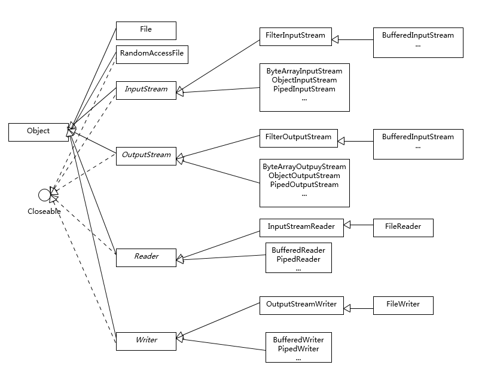

##1. 谈谈你对Java平台的理解
Java 本身是一种面向对象的语言，最显著的特性有两个方面，一是所谓的“书写一次，到处运行”（Write once, run anywhere），能够非常容易地获得跨平台能力；另外就是垃圾收集（GC, Garbage Collection），Java 通过垃圾收集器（Garbage Collector）回收分配内存，大部分情况下，程序员不需要自己操心内存的分配和回收。

我们日常会接触到 JRE（Java Runtime Environment）或者 JDK（Java Development Kit）。 JRE，也就是 Java 运行环境，包含了 JVM 和 Java 类库，以及一些模块等。而 JDK 可以看作是 JRE 的一个超集，提供了更多工具，比如编译器、各种诊断工具等。

对于“Java 是解释执行”这句话，这个说法不太准确。我们开发的 Java 的源代码，首先通过 Javac 编译成为字节码（bytecode），然后，在运行时，通过 Java 虚拟机（JVM）内嵌的解释器将字节码转换成为最终的机器码。但是常见的 JVM，比如我们大多数情况使用的 Oracle JDK 提供的 Hotspot JVM，都提供了 JIT（Just-In-Time）编译器，也就是通常所说的动态编译器，JIT 能够在运行时将热点代码编译成机器码，这种情况下部分热点代码就属于编译执行，而不是解释执行了。

##2. Exception和Error有什么区别？
Exception 和 Error 都是继承了 Throwable 类，在 Java 中只有 Throwable 类型的实例才可以被抛出（throw）或者捕获（catch），它是异常处理机制的基本组成类型。

Exception 和 Error 体现了 Java 平台设计者对不同异常情况的分类。Exception 是程序正常运行中，可以预料的意外情况，可能并且应该被捕获，进行相应处理。

Error 是指在正常情况下，不大可能出现的情况，绝大部分的 Error 都会导致程序（比如 JVM 自身）处于非正常的、不可恢复状态。既然是非正常情况，所以不便于也不需要捕获，常见的比如 OutOfMemoryError 之类，都是 Error 的子类。

Exception 又分为可检查（checked）异常和不检查（unchecked）异常，可检查异常在源代码里必须显式地进行捕获处理，这是编译期检查的一部分。前面我介绍的不可查的 Error，是 Throwable 不是 Exception。

不检查异常就是所谓的运行时异常，类似 NullPointerException、ArrayIndexOutOfBoundsException 之类，通常是可以编码避免的逻辑错误，具体根据需要来判断是否需要捕获，并不会在编译期强制要求。

## 3. 谈谈final、finally、 finalize有什么不同
final 可以用来修饰类、方法、变量，分别有不同的意义，final 修饰的 class 代表不可以继承扩展，final 的变量是不可以修改的，而 final 的方法也是不可以重写的（override）。

finally 则是 Java 保证重点代码一定要被执行的一种机制。我们可以使用 try-finally 或者 try-catch-finally 来进行类似关闭 JDBC 连接、保证 unlock 锁等动作。

finalize 是基础类 java.lang.Object 的一个方法，它的设计目的是保证对象在被垃圾收集前完成特定资源的回收。finalize 机制现在已经不推荐使用，并且在 JDK 9 开始被标记为 deprecated。

## 4.强引用、软引用、弱引用、幻象引用有什么区别？
不同的引用类型，主要体现的是对象不同的可达性（reachable）状态和对垃圾收集的影响。

所谓强引用（“Strong” Reference），就是我们最常见的普通对象引用，只要还有强引用指向一个对象，就能表明对象还“活着”，垃圾收集器不会碰这种对象。对于一个普通的对象，如果没有其他的引用关系，只要超过了引用的作用域或者显式地将相应（强）引用赋值为 null，就是可以被垃圾收集的了，当然具体回收时机还是要看垃圾收集策略。

软引用（SoftReference），是一种相对强引用弱化一些的引用，可以让对象豁免一些垃圾收集，只有当 JVM 认为内存不足时，才会去试图回收软引用指向的对象。JVM 会确保在抛出 OutOfMemoryError 之前，清理软引用指向的对象。软引用通常用来实现内存敏感的缓存，如果还有空闲内存，就可以暂时保留缓存，当内存不足时清理掉，这样就保证了使用缓存的同时，不会耗尽内存。

弱引用（WeakReference）并不能使对象豁免垃圾收集，仅仅是提供一种访问在弱引用状态下对象的途径。这就可以用来构建一种没有特定约束的关系，比如，维护一种非强制性的映射关系，如果试图获取时对象还在，就使用它，否则重现实例化。它同样是很多缓存实现的选择。

对于幻象引用，有时候也翻译成虚引用，你不能通过它访问对象。幻象引用仅仅是提供了一种确保对象被 finalize 以后，做某些事情的机制，比如，通常用来做所谓的 Post-Mortem 清理机制，我在专栏上一讲中介绍的 Java 平台自身 Cleaner 机制等，也有人利用幻象引用监控对象的创建和销毁。

* 1. 对象可达性状态流转分析

     强可达（Strongly Reachable），就是当一个对象可以有一个或多个线程可以不通过各种引用访问到的情况。比如，我们新创建一个对象，那么创建它的线程对它就是强可达。
     
     软可达（Softly Reachable），就是当我们只能通过软引用才能访问到对象的状态。

     弱可达（Weakly Reachable），类似前面提到的，就是无法通过强引用或者软引用访问，只能通过弱引用访问时的状态。这是十分临近 finalize 状态的时机，
        当弱引用被清除的时候，就符合 finalize 的条件了。
     
     幻象可达（Phantom Reachable），上面流程图已经很直观了，就是没有强、软、弱引用关联，并且 finalize 过了，只有幻象引用指向这个对象的时候。

     当然，还有一个最后的状态，就是不可达（unreachable），意味着对象可以被清除了。

检查弱引用指向对象是否被垃圾收集，也是诊断是否有特定内存泄漏的一个思路，如果我们的框架使用到弱引用又怀疑有内存泄漏，就可以从这个角度检查。

* 在Java语言中，除了基本数据类型外，其他的都是指向各类对象的对象引用；Java中根据其生命周期的长短，将引用分为4类。

1 强引用

特点：我们平常典型编码Object obj = new Object()中的obj就是强引用。通过关键字new创建的对象所关联的引用就是强引用。 当JVM内存空间不足，JVM宁愿抛出OutOfMemoryError运行时错误（OOM），使程序异常终止，也不会靠随意回收具有强引用的“存活”对象来解决内存不足的问题。对于一个普通的对象，如果没有其他的引用关系，只要超过了引用的作用域或者显式地将相应（强）引用赋值为 null，就是可以被垃圾收集的了，具体回收时机还是要看垃圾收集策略。

2 软引用

特点：软引用通过SoftReference类实现。 软引用的生命周期比强引用短一些。只有当 JVM 认为内存不足时，才会去试图回收软引用指向的对象：即JVM 会确保在抛出 OutOfMemoryError 之前，清理软引用指向的对象。软引用可以和一个引用队列（ReferenceQueue）联合使用，如果软引用所引用的对象被垃圾回收器回收，Java虚拟机就会把这个软引用加入到与之关联的引用队列中。后续，我们可以调用ReferenceQueue的poll()方法来检查是否有它所关心的对象被回收。如果队列为空，将返回一个null,否则该方法返回队列中前面的一个Reference对象。

应用场景：软引用通常用来实现内存敏感的缓存。如果还有空闲内存，就可以暂时保留缓存，当内存不足时清理掉，这样就保证了使用缓存的同时，不会耗尽内存。

3 弱引用

弱引用通过WeakReference类实现。 弱引用的生命周期比软引用短。在垃圾回收器线程扫描它所管辖的内存区域的过程中，一旦发现了具有弱引用的对象，不管当前内存空间足够与否，都会回收它的内存。由于垃圾回收器是一个优先级很低的线程，因此不一定会很快回收弱引用的对象。弱引用可以和一个引用队列（ReferenceQueue）联合使用，如果弱引用所引用的对象被垃圾回收，Java虚拟机就会把这个弱引用加入到与之关联的引用队列中。

应用场景：弱应用同样可用于内存敏感的缓存。

4 虚引用

特点：虚引用也叫幻象引用，通过PhantomReference类来实现。无法通过虚引用访问对象的任何属性或函数。幻象引用仅仅是提供了一种确保对象被 finalize 以后，做某些事情的机制。如果一个对象仅持有虚引用，那么它就和没有任何引用一样，在任何时候都可能被垃圾回收器回收。虚引用必须和引用队列 （ReferenceQueue）联合使用。当垃圾回收器准备回收一个对象时，如果发现它还有虚引用，就会在回收对象的内存之前，把这个虚引用加入到与之关联的引用队列中。
ReferenceQueue queue = new ReferenceQueue ();
PhantomReference pr = new PhantomReference (object, queue);
程序可以通过判断引用队列中是否已经加入了虚引用，来了解被引用的对象是否将要被垃圾回收。如果程序发现某个虚引用已经被加入到引用队列，那么就可以在所引用的对象的内存被回收之前采取一些程序行动。

应用场景：可用来跟踪对象被垃圾回收器回收的活动，当一个虚引用关联的对象被垃圾收集器回收之前会收到一条系统通知。

## 5.String、StringBuffer、StringBuilder有什么区别？
String 是 Java 语言非常基础和重要的类，提供了构造和管理字符串的各种基本逻辑。它是典型的 Immutable 类，被声明成为 final class，所有属性也都是 final 的。也由于它的不可变性，类似拼接、裁剪字符串等动作，都会产生新的 String 对象。由于字符串操作的普遍性，所以相关操作的效率往往对应用性能有明显影响。

StringBuffer 是为解决上面提到拼接产生太多中间对象的问题而提供的一个类，我们可以用 append 或者 add 方法，把字符串添加到已有序列的末尾或者指定位置。StringBuffer 本质是一个**线程安全**的可修改字符序列，它保证了线程安全，也随之带来了额外的性能开销，所以除非有线程安全的需要，不然还是推荐使用它的后继者，也就是 StringBuilder。

StringBuilder 是 Java 1.5 中新增的，在能力上和 StringBuffer 没有本质区别，但是它去掉了线程安全的部分，有效减小了开销，是绝大部分情况下进行字符串拼接的首选。

## 6.动态代理是基于什么原理？
反射机制是 Java 语言提供的一种基础功能，赋予程序在运行时自省（introspect，官方用语）的能力。通过反射我们可以直接操作类或者对象，比如获取某个对象的类定义，获取类声明的属性和方法，调用方法或者构造对象，甚至可以运行时修改类定义。

动态代理是一种方便运行时动态构建代理、动态处理代理方法调用的机制，很多场景都是利用类似机制做到的，比如用来包装 RPC 调用、面向切面的编程（AOP）。

实现动态代理的方式很多，比如 JDK 自身提供的动态代理，就是主要利用了上面提到的反射机制。还有其他的实现方式，比如利用传说中更高性能的字节码操作机制，类似 ASM、cglib（基于 ASM）、Javassist 等。

* JDK Proxy 的优势：

最小化依赖关系，减少依赖意味着简化开发和维护，JDK 本身的支持，可能比 cglib 更加可靠。

平滑进行 JDK 版本升级，而字节码类库通常需要进行更新以保证在新版 Java 上能够使用。

代码实现简单。

* 基于类似 cglib 框架的优势：
有的时候调用目标可能不便实现额外接口，从某种角度看，限定调用者实现接口是有些侵入性的实践，类似 cglib 动态代理就没有这种限制。

只操作我们关心的类，而不必为其他相关类增加工作量。

高性能。

## 7 int 和 Integer 有什么区别？谈谈 Integer 的值缓存范围。
int 是我们常说的整形数字，是 Java 的 8 个原始数据类型（Primitive Types，boolean、byte 、short、char、int、float、double、long）之一。Java 语言虽然号称一切都是对象，但原始数据类型是例外。

Integer 是 int 对应的包装类，它有一个 int 类型的字段存储数据，并且提供了基本操作，比如数学运算、int 和字符串之间转换等。在 Java 5 中，引入了自动装箱和自动拆箱功能（boxing/unboxing），Java 可以根据上下文，自动进行转换，极大地简化了相关编程。

关于 Integer 的值缓存，这涉及 Java 5 中另一个改进。构建 Integer 对象的传统方式是直接调用构造器，直接 new 一个对象。但是根据实践，我们发现大部分数据操作都是集中在有限的、较小的数值范围，因而，在 Java 5 中新增了静态工厂方法 valueOf，在调用它的时候会利用一个缓存机制，带来了明显的性能改进。按照 Javadoc，这个值默认缓存是 -128 到 127 之间。

## 8 对比Vector、ArrayList、LinkedList有何区别？
这三者都是实现集合框架中的 List，也就是所谓的有序集合，因此具体功能也比较近似，比如都提供按照位置进行定位、添加或者删除的操作，都提供迭代器以遍历其内容等。但因为具体的设计区别，在行为、性能、线程安全等方面，表现又有很大不同。

Vector 是 Java 早期提供的线程安全的动态数组，如果不需要线程安全，并不建议选择，毕竟同步是有额外开销的。Vector 内部是使用对象数组来保存数据，可以根据需要自动的增加容量，当数组已满时，会创建新的数组，并拷贝原有数组数据。

ArrayList 是应用更加广泛的动态数组实现，它本身不是线程安全的，所以性能要好很多。与 Vector 近似，ArrayList 也是可以根据需要调整容量，不过两者的调整逻辑有所区别，Vector 在扩容时会提高 1 倍，而 ArrayList 则是增加 50%。

LinkedList 顾名思义是 Java 提供的双向链表，所以它不需要像上面两种那样调整容量，它也不是线程安全的。

**不同容器类型适合的场景：**

Vector 和 ArrayList 作为动态数组，其内部元素以数组形式顺序存储的，所以非常适合随机访问的场合。除了尾部插入和删除元素，往往性能会相对较差，比如我们在中间位置插入一个元素，需要移动后续所有元素。

而 LinkedList 进行节点插入、删除却要高效得多，但是随机访问性能则要比动态数组慢。

**Java 的集合框架**

* List，也就是我们前面介绍最多的有序集合，它提供了方便的访问、插入、删除等操作。
* Set，Set 是不允许重复元素的，这是和 List 最明显的区别，也就是不存在两个对象 equals 返回 true。我们在日常开发中有很多需要保证元素唯一性的场合。
* Queue/Deque，则是 Java 提供的标准队列结构的实现，除了集合的基本功能，它还支持类似先入先出（FIFO， First-in-First-Out）或者后入先出（LIFO，Last-In-First-Out）等特定行为。这里不包括 BlockingQueue，因为通常是并发编程场合，所以被放置在并发包里。

**Set 实例：**

* TreeSet 支持自然顺序访问，但是添加、删除、包含等操作要相对低效（log(n) 时间）。
* HashSet 则是利用哈希算法，理想情况下，如果哈希散列正常，可以提供常数时间的添加、删除、包含等操作，但是它不保证有序。
* LinkedHashSet，内部构建了一个记录插入顺序的双向链表，因此提供了按照插入顺序遍历的能力，与此同时，也保证了常数时间的添加、删除、包含等操作，这些操作性能略低于 HashSet，因为需要维护链表的开销。
* 在遍历元素时，HashSet 性能受自身容量影响，所以初始化时，除非有必要，不然不要将其背后的 HashMap 容量设置过大。而对于 LinkedHashSet，由于其内部链表提供的方便，遍历性能只和元素多少有关系。

## 9 对比Hashtable、HashMap、TreeMap有什么不同？
Hashtable、HashMap、TreeMap 都是最常见的一些 Map 实现，是以键值对的形式存储和操作数据的容器类型。

Hashtable 是早期 Java 类库提供的一个哈希表实现，本身是同步的，不支持 null 键和值，由于同步导致的性能开销，所以已经很少被推荐使用。

HashMap 是应用更加广泛的哈希表实现，行为上大致上与 HashTable 一致，主要区别在于 HashMap 不是同步的，支持 null 键和值等。通常情况下，HashMap 进行 put 或者 get 操作，可以达到常数时间的性能，所以它是绝大部分利用键值对存取场景的首选，比如，实现一个用户 ID 和用户信息对应的运行时存储结构。

TreeMap 则是基于红黑树的一种提供顺序访问的 Map，和 HashMap 不同，它的 get、put、remove 之类操作都是 O（log(n)）的时间复杂度，具体顺序可以由指定的 Comparator 来决定，或者根据键的自然顺序来判断。

HashMap 的性能表现非常依赖于哈希码的有效性，请务必掌握 hashCode 和 equals 的一些基本约定

## 10 如何保证集合是线程安全的? ConcurrentHashMap如何实现高效地线程安全？
Java 提供了不同层面的线程安全支持。在传统集合框架内部，除了 Hashtable 等同步容器，还提供了所谓的同步包装器（Synchronized Wrapper），我们可以调用 Collections 工具类提供的包装方法，来获取一个同步的包装容器（如 Collections.synchronizedMap），但是它们都是利用非常粗粒度的同步方式，在高并发情况下，性能比较低下。

另外，更加普遍的选择是利用并发包提供的线程安全容器类，它提供了：

* 各种并发容器，比如 ConcurrentHashMap、CopyOnWriteArrayList。
* 各种线程安全队列（Queue/Deque），如 ArrayBlockingQueue、SynchronousQueue。
* 各种有序容器的线程安全版本等。
* 
具体保证线程安全的方式，包括有从简单的 synchronize 方式，到基于更加精细化的，比如基于分离锁实现的 ConcurrentHashMap 等并发实现等。具体选择要看开发的场景需求，总体来说，并发包内提供的容器通用场景，远优于早期的简单同步实现。

## 11 Java提供了哪些IO方式？ NIO如何实现多路复用？
Java IO 方式有很多种，基于不同的 IO 抽象模型和交互方式，可以进行简单区分。

第一，传统的 java.io 包，它基于流模型实现，提供了我们最熟知的一些 IO 功能，比如 File 抽象、输入输出流等。交互方式是同步、阻塞的方式，也就是说，在读取输入流或者写入输出流时，在读、写动作完成之前，线程会一直阻塞在那里，它们之间的调用是可靠的线性顺序。

java.io 包的好处是代码比较简单、直观，缺点则是 IO 效率和扩展性存在局限性，容易成为应用性能的瓶颈。
很多时候，人们也把 java.net 下面提供的部分网络 API，比如 Socket、ServerSocket、HttpURLConnection 也归类到同步阻塞 IO 类库，因为网络通信同样是 IO 行为。

第二，在 Java  1.4 中引入了 NIO 框架（java.nio 包），提供了 Channel、Selector、Buffer 等新的抽象，可以构建多路复用的、同步非阻塞 IO 程序，同时提供了更接近操作系统底层的高性能数据操作方式。

第三，在 Java 7 中，NIO 有了进一步的改进，也就是 NIO 2，引入了异步非阻塞 IO 方式，也有很多人叫它 AIO（Asynchronous IO）。异步 IO 操作基于**事件和回调机制**，可以简单理解为，应用操作直接返回，而不会阻塞在那里，当后台处理完成，操作系统会通知相应线程进行后续工作。

同步是一种可靠的有序运行机制，当我们进行同步操作时，后续的任务是等待当前调用返回，才会进行下一步；而异步则相反，其他任务不需要等待当前调用返回，通常依靠事件、回调等机制来实现任务间次序关系。

区分阻塞与非阻塞（blocking/non-blocking）。在进行阻塞操作时，当前线程会处于阻塞状态，无法从事其他任务，只有当条件就绪才能继续，比如 ServerSocket 新连接建立完毕，或数据读取、写入操作完成；而非阻塞则是不管 IO 操作是否结束，直接返回，相应操作在后台继续处理。

* 输入流、输出流（InputStream/OutputStream）是用于读取或写入字节的，例如操作图片文件。
* 而 Reader/Writer 则是用于操作字符，增加了字符编解码等功能，适用于类似从文件中读取或者写入文本信息。本质上计算机操作的都是字节，不管是网络通信还是文件读取，Reader/Writer 相当于构建了应用逻辑和原始数据之间的桥梁。
* BufferedOutputStream 等带缓冲区的实现，可以避免频繁的磁盘读写，进而提高 IO 处理效率。这种设计利用了缓冲区，将批量数据进行一次操作，但在使用中千万别忘了 flush。

**NIO 的主要组成部分：**

* Buffer，高效的数据容器，除了布尔类型，所有原始数据类型都有相应的 Buffer 实现。
* Channel，类似在 Linux 之类操作系统上看到的文件描述符，是 NIO 中被用来支持批量式 IO 操作的一种抽象。
* File 或者 Socket，通常被认为是比较高层次的抽象，而 Channel 则是更加操作系统底层的一种抽象，这也使得 NIO 得以充分利用现代操作系统底层机制，获得特定场景的性能优化，例如，DMA（Direct Memory Access）等。不同层次的抽象是相互关联的，我们可以通过 Socket 获取 Channel，反之亦然。
* Selector，是 NIO 实现多路复用的基础，它提供了一种高效的机制，可以检测到注册在 Selector 上的多个 Channel 中，是否有 Channel 处于就绪状态，进而实现了单线程对多 Channel 的高效管理。Selector 同样是基于底层操作系统机制，不同模式、不同版本都存在区别，例如，在最新的代码库里，相关实现如下：
* Charset，提供 Unicode 字符串定义，NIO 也提供了相应的编解码器等，例如，通过下面的方式进行字符串到 ByteBuffer 的转换： Charset.defaultCharset().encode("Hello world!"));

## 12 Java有几种文件拷贝方式？哪一种最高效？
